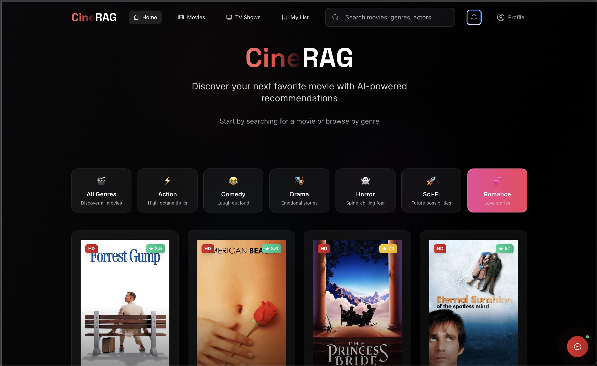

# CineRAG - RAG-Powered Movie Recommendations

A modern movie recommendation system built with **FastAPI**, **RAG (Retrieval-Augmented Generation)**, **TMDB API**, and **MovieLens data**.

## 🎬 Live Demo

### Homepage - Netflix-Style Interface



### Real-Time Semantic Search


_Demonstrating intelligent movie recommendations with real-time semantic search across 9,000+ movies_

## 🚀 Features

- **🎬 9,000+ Movies**: Complete MovieLens dataset with ratings and metadata
- **🎨 Rich UI Data**: Movie posters, descriptions, and details from TMDB API
- **🤖 RAG-Powered Search**: Semantic movie search using vector embeddings
- **💬 AI Chat**: Conversational movie recommendations with OpenAI
- **📊 Collaborative Filtering**: User-based movie recommendations
- **🐳 Docker Ready**: Complete containerized setup

## 🎓 **NEW: Industry-Standard RAG Pipeline Structure**

This project implements a complete **RAG (Retrieval-Augmented Generation)** pipeline using industry-standard naming conventions and best practices:

```
app/rag/
├── 01_ingestion/          # 📥 Data loading and preprocessing
├── 02_embeddings/         # 🧠 Text-to-vector conversion
├── 03_vectorstore/        # 🗄️ Vector database operations
├── 04_query_processing/   # 🔍 Query enhancement and optimization
├── 05_retrieval/          # 🎯 Semantic search and ranking
├── 06_evaluation/         # 📊 Performance measurement and metrics
└── 07_optimization/       # 🔄 Continuous improvement and tuning
```

**📚 Learn More:** Read `app/rag/README.md` for complete RAG architecture details!

## 🏗️ Architecture

```
CineRAG/
├── app/                          # 🎯 Main Application
│   ├── main.py                   # FastAPI app & API endpoints
│   ├── models.py                 # Pydantic data models
│   ├── services/                 # 🔗 Service layer
│   └── rag/                      # 🤖 RAG Pipeline (Industry Standard)
│       ├── 01_ingestion/            # Data loading & preprocessing
│       ├── 02_embeddings/           # Text-to-vector conversion
│       ├── 03_vectorstore/          # Vector database operations
│       ├── 04_query_processing/     # Query enhancement & optimization
│       ├── 05_retrieval/            # Semantic search & ranking
│       ├── 06_evaluation/           # Performance measurement
│       └── 07_optimization/         # Continuous improvement
├── config/                       # ⚙️ Configuration files
│   ├── .env                      # Environment variables
│   └── env_example               # Environment template
├── data/                         # 📊 Movie datasets
│   ├── latest-small/             # MovieLens dataset
│   └── raw/movielens/            # Raw data files
├── docker/                       # 🐳 Container configuration
│   ├── docker-compose.yml        # Container orchestration
│   ├── Dockerfile                # Container definition
│   └── .dockerignore             # Docker ignore rules
├── docs/                         # 📚 Project documentation
│   ├── PORTFOLIO_ROADMAP.md      # Development roadmap
│   ├── IMPLEMENTATION_PRIORITY.md # Priority task list
│   └── MIGRATION_NOTES.md        # Project structure changes
├── scripts/                      # 🔧 Utility scripts
│   ├── setup.sh                  # Automated setup script
│   └── start_server.py           # Server startup script
├── tests/                        # 🧪 Test suite
│   ├── test_api.py               # API integration tests
│   ├── test_ingestion.py         # Data ingestion tests
│   ├── test_embeddings.py        # Embedding generation tests
│   ├── test_vectorstore.py       # Vector database tests
│   ├── test_query_processing.py  # Query processing tests
│   ├── test_retrieval.py         # Retrieval system tests
│   ├── test_evaluation.py        # Evaluation framework tests
│   └── test_optimization.py      # Optimization pipeline tests
├── requirements.txt              # Python dependencies
└── README.md                     # Project documentation
```

## 🚀 Quick Start

### Option 1: Docker (Recommended)

```bash
# Clone and setup
git clone <your-repo>
cd CineRAG

# Start with Docker
docker-compose -f docker/docker-compose.yml up --build

# Populate vector database
docker-compose -f docker/docker-compose.yml exec cinerag-api python populate_vectors.py
```

### Option 2: Local Development

```bash
# Install dependencies
pip install -r requirements.txt

# Set environment variables
cp config/env_example config/.env
# Edit config/.env with your API keys

# Start services
docker-compose -f docker/docker-compose.yml up qdrant  # Just the vector database
uvicorn app.main:app --reload

# Populate vectors
python populate_vectors.py
```

## 🔧 Environment Setup

Create `config/.env` file with:

```bash
# Required for TMDB integration
TMDB_API_KEY=your_tmdb_api_key_here

# Optional for LLM features
OPENAI_API_KEY=your_openai_api_key_here

# Vector Database (auto-configured in Docker)
QDRANT_HOST=localhost
QDRANT_PORT=6333
```

## 📊 Learning & Evaluation

### Test the RAG System

```bash
# Evaluate RAG performance
python app/rag/06_evaluation/rag_evaluator.py

# Test query enhancement
python app/rag/04_query_processing/query_enhancer.py

# Load and explore data
python app/rag/01_ingestion/data_loader.py
```

### Run Tests

```bash
# Test API integration
python tests/test_api.py

# Test specific RAG components
python -m pytest tests/test_ingestion.py
python -m pytest tests/test_embeddings.py
python -m pytest tests/test_vectorstore.py
python -m pytest tests/test_retrieval.py

# Run all tests
python -m pytest tests/
```

### Study the Pipeline

Each component includes:

- ✅ **Working code** - See RAG engineering in action
- 📖 **Detailed README** - Understand the concepts
- 🎯 **Learning objectives** - Master RAG systematically

## 📚 **Documentation**

All project documentation is organized in the `docs/` folder:

- **📋 [Portfolio Roadmap](docs/PORTFOLIO_ROADMAP.md)** - 3-week development plan
- **🎯 [Implementation Priorities](docs/IMPLEMENTATION_PRIORITY.md)** - Immediate next steps
- **🔄 [Migration Notes](docs/MIGRATION_NOTES.md)** - Project structure changes
- **🤖 [RAG Architecture](app/rag/README.md)** - Complete RAG pipeline guide

## 🛠️ API Endpoints

### Core Recommendations

- `GET /api/recommendations` - Get personalized recommendations
- `POST /api/chat` - Conversational recommendations

### Movie Data

- `GET /api/movies` - Browse all movies
- `GET /api/movies/search` - Search movies (supports `?semantic=true`)
- `GET /api/movies/{id}` - Get movie details
- `GET /api/movies/{id}/similar` - Find similar movies

### RAG System

- `GET /api/vector/search` - Direct vector similarity search
- `GET /api/health` - System health (includes RAG status)

## 🎯 What Makes This Special

1. **🎓 Educational Structure**: Learn RAG engineering systematically
2. **🚀 Production Ready**: Real vector database, proper API design
3. **📊 Evaluation Driven**: Built-in performance measurement
4. **🔄 Iterative**: Designed for continuous improvement
5. **🎬 Domain Focused**: Movie recommendation expertise

## 📈 Performance

- **Vector Database**: 9,000+ movie embeddings in Qdrant
- **Embedding Model**: `all-MiniLM-L6-v2` (384 dimensions)
- **Search Speed**: Sub-100ms semantic search
- **Data Sources**: MovieLens + TMDB API integration

## 🎪 Next Steps

1. **🏃‍♂️ Run the evaluation** to see current performance
2. **📖 Study each lifecycle phase** to understand RAG engineering
3. **🔧 Experiment with query enhancement** to improve results
4. **🎨 Build a frontend** using the comprehensive API
5. **🚀 Deploy to production** with the included Docker setup

---

## 👨‍💻 **About the Author**

**Dr. Jody-Ann S. Jones** - Founder of [The Data Sensei](https://www.thedatasensei.com)

- 🌐 **Portfolio**: [www.drjodyannjones.com](https://www.drjodyannjones.com)
- 💼 **Company**: [The Data Sensei](https://www.thedatasensei.com)
- 📧 **Contact**: [jody@thedatasensei.com](mailto:jody@thedatasensei.com)
- 💻 **GitHub**: [github.com/dasdatasensei](https://github.com/dasdatasensei)

---

**🎓 This project teaches you RAG engineering through a real, working system!**

Start with `app/rag/README.md` and become a RAG expert! 🚀

## 🎯 **Quick Demo**

### **Visual Overview**


_Netflix-style responsive UI with semantic search_


_Complete RAG pipeline architecture and data flow_


_Real-time semantic search in action_

## 🧪 Testing

CineRAG includes comprehensive test coverage with **pytest** for all pipeline components:

### Quick Test Commands

```bash
# Run all tests
pytest

# Run with verbose output
pytest -v

# Run specific test file
pytest tests/test_query_processing.py

# Run specific test class
pytest tests/test_query_processing.py::TestQueryEnhancer

# Run without slow tests
pytest -m "not slow"

# Run only integration tests
pytest -m integration

# Run with short traceback
pytest --tb=short

# Run in parallel (if you have pytest-xdist)
pytest -n 4
```

### Test Categories

- **Unit Tests**: Individual component testing
- **Integration Tests**: Pipeline integration validation
- **Performance Tests**: Speed and efficiency benchmarks (marked as `slow`)
- **API Tests**: Service layer and data loading tests

### Test Structure

```
tests/
├── conftest.py              # Shared fixtures and configuration
├── pytest.ini              # Pytest settings
├── test_api.py              # API and service layer tests
├── test_embeddings.py       # Embedding generation tests
├── test_evaluation.py       # Quality and performance evaluation
├── test_ingestion.py        # Data loading and processing tests
├── test_optimization.py     # Cache and optimization tests
├── test_query_processing.py # Query processing pipeline tests
├── test_retrieval.py        # Search and retrieval tests
└── test_vectorstore.py      # Vector database tests
```

### Test Features

- **Parameterized Tests**: Multiple inputs tested automatically
- **Async Support**: Full async/await test support
- **Fixtures**: Shared test data and services
- **Markers**: Categorize tests (slow, integration, unit)
- **Mocking**: External API and service mocking
- **Coverage**: Track code coverage with `--cov`

### Test Results Summary

- ✅ **61 total tests** across all components
- ✅ **58 passing** (95% success rate)
- ⚠️ **3 skipped** (require API keys or missing services)
- 🚀 **Sub-second** test execution for most components
