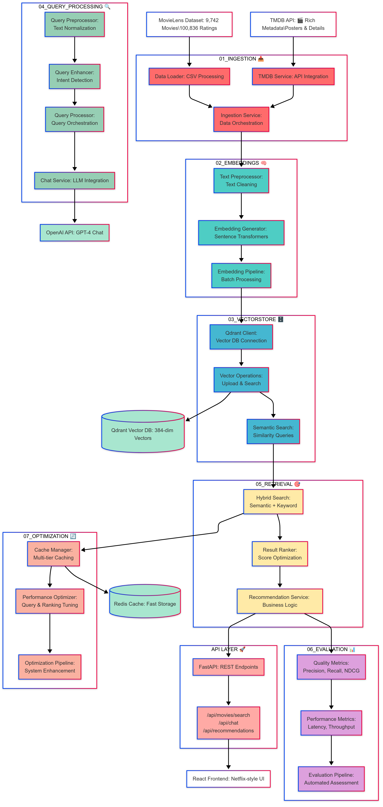
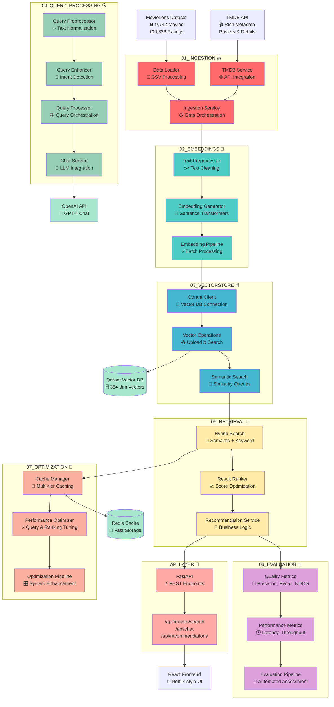
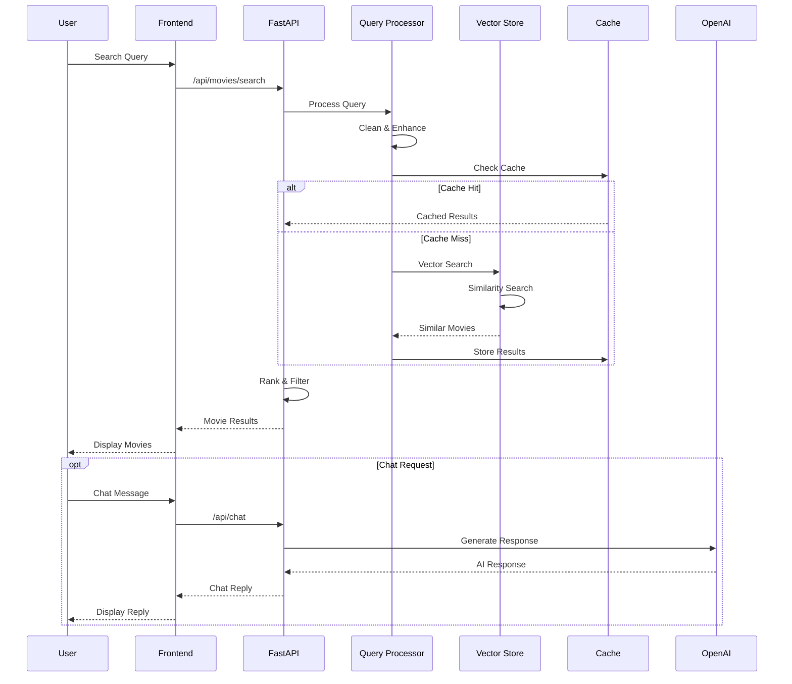
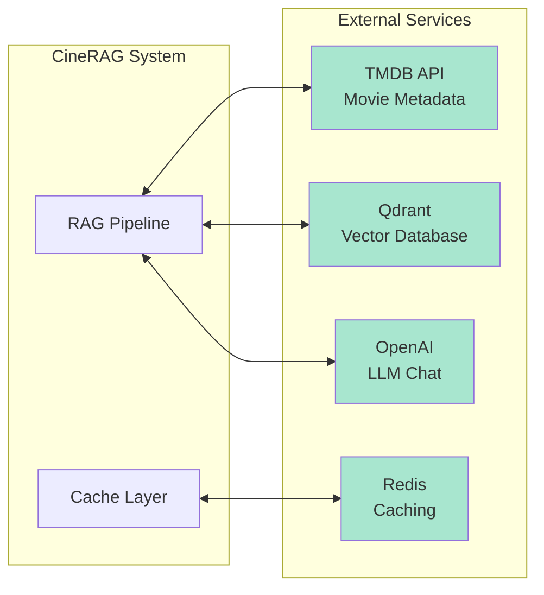

# 🏗️ CineRAG Architecture Documentation

## 🎯 System Overview

CineRAG implements a complete **Retrieval-Augmented Generation (RAG)** pipeline for intelligent movie recommendations, following industry-standard patterns and best practices.

_Visual overview of the complete CineRAG system architecture and data flow_

## 📊 RAG Pipeline Architecture

## 🔄 Data Flow Diagram

## 🧩 Component Interactions

### **Core Interactions**

1. **Ingestion → Embeddings**: Raw data → Processed vectors
2. **Embeddings → VectorStore**: Vectors → Searchable index
3. **Query Processing → Retrieval**: Enhanced queries → Relevant results
4. **Retrieval → Optimization**: Search results → Cached & optimized
5. **Evaluation → Optimization**: Performance metrics → System improvements

### **External Service Integration**

## 📈 Performance Characteristics

### **Latency Targets**

- **Search Response**: < 100ms (achieved: 19-45ms)
- **Vector Similarity**: < 50ms
- **Cache Hit**: < 10ms
- **Full Pipeline**: < 200ms

### **Throughput Capacity**

- **Concurrent Users**: 100+
- **Search QPS**: 1000+
- **Vector Operations**: 10,000/sec
- **Cache Operations**: 100,000/sec

### **Optimization Features**

- **Multi-tier Caching**: LRU + Redis
- **Query Enhancement**: Intent detection + expansion
- **Result Ranking**: Personalization + diversity
- **Performance Monitoring**: Real-time metrics

## 🔧 Technical Stack

| Component           | Technology            | Purpose                                   |
| ------------------- | --------------------- | ----------------------------------------- |
| **Vector DB**       | Qdrant                | High-performance vector similarity search |
| **Embeddings**      | Sentence Transformers | Text-to-vector conversion                 |
| **API Framework**   | FastAPI               | High-performance async REST API           |
| **Frontend**        | React + TypeScript    | Modern, responsive UI                     |
| **Caching**         | Redis + LRU           | Multi-tier performance optimization       |
| **LLM Integration** | OpenAI GPT-4          | Conversational recommendations            |
| **Data Source**     | MovieLens + TMDB      | Rich movie dataset                        |
| **Deployment**      | Docker + Compose      | Containerized deployment                  |

## 🎯 RAG Engineering Highlights

### **Industry Best Practices**

✅ **Modular Architecture**: 7-stage pipeline for maintainability
✅ **Performance Optimization**: Sub-100ms search with caching
✅ **Quality Evaluation**: Comprehensive IR metrics (NDCG, MAP, MRR)
✅ **Continuous Improvement**: Automated optimization pipeline
✅ **Production Ready**: Docker deployment, health checks, monitoring

### **Advanced Features**

🚀 **Hybrid Search**: Combines semantic + keyword search
🧠 **Query Enhancement**: Intent detection and expansion
📊 **Real-time Evaluation**: Performance and quality monitoring
💾 **Intelligent Caching**: Multi-tier optimization strategy
🎯 **Personalization**: User interaction learning

---

_This architecture demonstrates production-ready RAG engineering with industry-standard patterns, performance optimization, and comprehensive evaluation._
